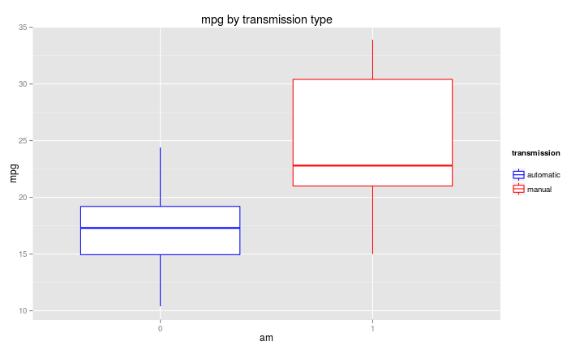
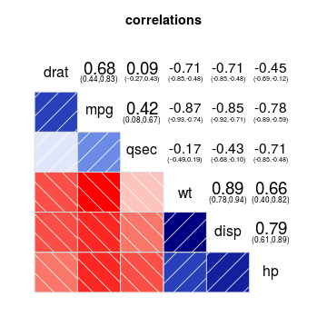
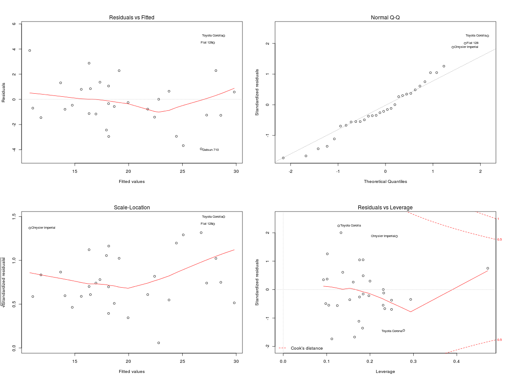

# Goal

Explore the relationship between a set of variables and miles per gallon (MPG) (outcome): Is an automatic or manual transmission better for MPG? Quantify the MPG difference between automatic and manual transmissions.

## Exploratory Analysis


```r
data(mtcars)
str(mtcars)
```

Reading *help(mtcars)* reveals that although all variables in the dataset are numerical, some are actually categorical -- so we convert them to factors.


```r
mtcars$cyl <- as.factor(mtcars$cyl)
mtcars$gear <- as.factor(mtcars$gear)
mtcars$carb <- as.factor(mtcars$carb)
mtcars$am <- as.factor(mtcars$am)
mtcars$vs <- as.factor(mtcars$vs)
```

Next we plot the miles-per-galon performance for each transmission type (fig. 1). Manual transmission has a higher average than automatic transmission.

Is the average *mpg* significantly (with 95% confidence) different for each transmission type? A t-test with a p-value lower than 0.05 shows that we should reject the null hypothesis stating that the mean mpg for each transmmission type is the same. So, it makes sense to look for a model of *mpg* in terms of *am*.


```r
mpg_for_automatic <- mtcars[which(mtcars$am == "0"),]$mpg
mpg_for_manual <- mtcars[which(mtcars$am == "1"),]$mpg
ttest <- t.test(mpg_for_automatic, mpg_for_manual)
ttest$p.value < 0.05
```

```
## [1] TRUE
```

## Regression analysis

First, we build a model with all variables.


```r
model.all <- lm(mpg ~ ., data=mtcars)
summary(model.all)$adj.r.squared
```

```
## [1] 0.7790215
```

The adjusted R-squared value shows a poor fit for this model. The reason: multicollinearity -- a plot of the correlation matrix indicates that some variables are highly correlated (fig. 2): *disp* amd *hp* are positively correlated, and both are also positively correlated to *wt*. Some of these variables should dissapear. In order to build a better model, first we try the minimum: keeping only the transmission type. Next, we use the *Stepwise* procedure to optimize the model using all variables, in order to obtain the best model that also has transmission type as one of its regressors.


```r
model.am <- lm(mpg ~ am, data=mtcars)
model.reduced.keep.am <- step(model.all, direction="both", scope=list(lower=~am))
```

### Model validation

Looking at the model graphs (fig. 3), we see that there is no discernible pattern when plotting residuals vs fitted values, therefore the residuals are independent. Also, the residuals are approximately normally distributed in the Q-Q plot. 

### Model comparison

A comparison of all three models shows that the transmission type on its own is a poor fit for predicting *mpg*, as we saw earlier, and the model that includes all variables is a bit better.


```r
summary(model.all)$adj.r.squared
```

```
## [1] 0.7790215
```

The model that only includes *cyl*, *hp*, *wt* and *am*  offers the best adjusted R-squared value -- this means that the variance in *mpg* is best explained by this combination of regressors, and the resulting model has the lowest residuals (i.e. the best fit).


```r
summary(model.reduced.keep.am)$adj.r.squared
```

```
## [1] 0.8400875
```

## Conclusion

We can conclude that manual transmission yields a better miles-per-gallon performance. How much? In average, the improvement over automatic transmission is given by the coefficient of the *am* variable:


```r
coefficients(model.reduced.keep.am)[6]
```

```
##      am1 
## 1.809211
```

In other words, 1.8092114 is the expected increase of *mpg* when switching from automatic to manual transmission.

-----

## Appendix

### fig. 1


```r
g <- ggplot(mtcars, aes(y=mpg, x=am, color=am))
g <- g + geom_boxplot() + ggtitle("mpg by transmission type")
g <- g + scale_color_manual("transmission\n",
			    labels = c("automatic", "manual"),
			    values = c("blue", "red"))
g
```

 

### fig. 2


```r
corrgram(mtcars,
	 order=TRUE,
	 lower.panel=panel.shade,
	 upper.panel=panel.conf,
	 text.panel=panel.txt,
	 main="correlations")
```

 

### fig. 3


```r
par(mfrow=c(2,2))
plot(model.reduced.keep.am)
```

 
